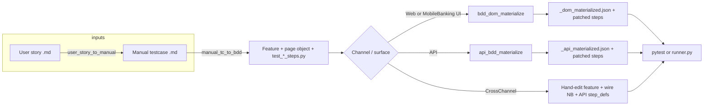
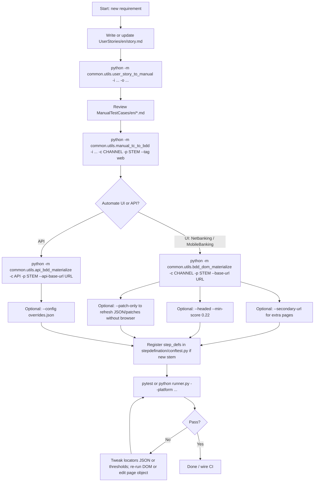

# Framework utilities — commands & effective workflow

**HTML version (diagrams + styling):** [`docs/presentations/qe-auto-utilities-workflow.html`](presentations/qe-auto-utilities-workflow.html)

All commands assume the **current working directory is `framework/`** (the folder that contains `runner.py`, `conftest.py`, and `common/`).

```bash
cd framework
```

On Windows PowerShell:

```powershell
cd framework
```

---

## 1. End-to-end flow (recommended)

Use this sequence when going from a **user story** to **runnable automated tests** with **locators** filled by the DOM materializer (self-heal style scanning).

| Step | What happens | Utility module |
|------|----------------|----------------|
| 1 | User story markdown → manual testcase markdown | `common.utils.user_story_to_manual` |
| 2 | Manual testcase markdown → Gherkin `.feature`, page object, `test_<stem>_steps.py` | `common.utils.manual_tc_to_bdd` |
| 3a (Web UI) | Scan live DOM, write `*_dom_materialized.json`, patch steps to use materialized runner | `common.utils.bdd_dom_materialize` |
| 3b (API) | Write `*_api_materialized.json`, patch steps for API contract runner | `common.utils.api_bdd_materialize` |
| 4 | Run tests, tune locators, optional runtime self-heal | `pytest` / `runner.py` + env (see §6) |

### Flowchart — documentation pipeline



### Flowchart — detailed decision (when to call which utility)



---

## 2. Command reference — `user_story_to_manual`

Converts **user story** markdown into **manual functional testcase** markdown (under `ManualTestCases/en/` by default).

```bash
python -m common.utils.user_story_to_manual -i UserStories/en/your_story.md -o ManualTestCases/en/your_story_manual.md
```

**Arguments**

| Argument | Short | Required | Description |
|----------|-------|----------|-------------|
| `--input` | `-i` | Yes | Path to user story `.md` |
| `--output` | `-o` | No | Output path (default: `ManualTestCases/en/<input_stem>_manual.md`) |
| `--app` | | No | Override “Application under test” one-liner |
| `--framework-root` | | No | Framework root if not default (`parent of common/`) |

**Default output location (when `-o` omitted)**

- Input: `UserStories/en/foo.md` → Output: `ManualTestCases/en/foo_manual.md`

---

## 3. Command reference — `manual_tc_to_bdd`

Converts **manual testcase** markdown into:

- `Features/nm/<stem>.feature` (Gherkin)
- `pageobject/nm/<stem>_page.py` (placeholder locators, often `TODO-*`)
- `stepdefination/nm/test_<stem>_steps.py` (scenarios + step wiring)

```bash
python -m common.utils.manual_tc_to_bdd -i ManualTestCases/en/example_manual.md -c Netbanking -p nb_my_feature_stem --tag web
```

**Arguments**

| Argument | Short | Required | Description |
|----------|-------|----------|-------------|
| `--input` | `-i` | Yes | Path to manual testcase markdown |
| `--channel` | `-c` | No | `Netbanking` (default), `MobileBanking`, `API`, `CrossChannel` |
| `--prefix` | `-p` | Yes | **File stem** for outputs (e.g. `nb_homefinance_emicalc_manual`) |
| `--tag` | | No | Gherkin tag(s); repeat for multiple. Default: `web` |
| `--framework-root` | | No | Path to `framework/` if not default |

**Examples**

```bash
# Netbanking web feature
python -m common.utils.manual_tc_to_bdd -i ManualTestCases/en/nm_calculator.md -c Netbanking -p nb_homefinance_emicalc_manual --tag web

# API channel (then use api_bdd_materialize — §5)
python -m common.utils.manual_tc_to_bdd -i ManualTestCases/en/api_leads.md -c API -p api_my_feature --tag api
```

**After this step**

- Ensure `stepdefination/conftest.py` for that channel lists your `*_step_defs` module in **`pytest_plugins`** (if steps are split; see `docs/TECHNICAL.md` §6.1).
- For **UI**: proceed to **`bdd_dom_materialize`** to replace TODO locators using the real DOM.

---

## 4. Command reference — `bdd_dom_materialize` (DOM scan & locator materialization)

Runs **Selenium** against `--base-url` (and optional `--secondary-url`), uses **DOM self-heal** heuristics to propose locators per step, writes **`pageobject/nm/<stem>_dom_materialized.json`**, and **patches** `test_<stem>_steps.py` so steps call `bdd_step_runner.execute_materialized_step(...)`.

```bash
python -m common.utils.bdd_dom_materialize -c Netbanking -p nb_homefinance_emicalc_manual --base-url https://example.com/ --secondary-url https://example.com/sub-page
```

**Arguments**

| Argument | Short | Required | Description |
|----------|-------|----------|-------------|
| `--channel` | `-c` | Yes | `Netbanking`, `MobileBanking`, `API`, `CrossChannel` |
| `--stem` | `-p` | Yes | Same stem as `manual_tc_to_bdd` (e.g. `nb_homefinance_emicalc_manual`) |
| `--base-url` | | Yes | Primary URL loaded for DOM scanning |
| `--secondary-url` | | No | Extra URL (e.g. calculator on another path) |
| `--browser` | | No | Default: `chrome` |
| `--headed` | | Flag | Headed browser (`HEADLESS=0` behavior) |
| `--min-score` | | No | Minimum DOM match score **0–1** (default `0.22`) |
| `--patch-only` | | Flag | **No browser**: reuse or init JSON and still patch step stubs |
| `--framework-root` | | No | Framework root if not default |

**Typical iteration**

1. First full scan with real URLs.
2. If selectors are weak, adjust `--min-score` or fix wording in manual/Gherkin steps (hints come from step text).
3. Use **`--patch-only`** after hand-editing `*_dom_materialized.json` to repatch steps without a long browser run.

---

## 5. Command reference — `api_bdd_materialize`

Writes **`pageobject/nm/<stem>_api_materialized.json`** (endpoints, payloads, headers with `${API_TOKEN}`-style placeholders) and patches steps to call **`api_bdd_step_runner.execute_api_materialized_step`**.

```bash
python -m common.utils.api_bdd_materialize -c API -p api_my_feature --api-base-url https://api.example.com
```

```bash
python -m common.utils.api_bdd_materialize -c API -p api_my_feature --api-base-url https://api.example.com --config path/to/overrides.json
```

**Arguments**

| Argument | Short | Required | Description |
|----------|-------|----------|-------------|
| `--channel` | `-c` | No | Default `API`; choices include `Netbanking`, `MobileBanking`, `API`, `CrossChannel` |
| `--stem` | `-p` | Yes | Stem (e.g. `api_my_feature`) |
| `--api-base-url` | | Yes | API base URL (no trailing slash required) |
| `--config` | | No | Optional JSON merged into materialized contract |
| `--framework-root` | | No | Framework root if not default |

Set secrets via environment (e.g. `API_TOKEN`, `API_KEY`) at test runtime — see `docs/TECHNICAL.md` §5.3.

---

## 6. After materialization — run tests & optional runtime self-heal

### Run via unified runner

```bash
python runner.py --platform web --tests-path Netbanking/stepdefination/nm/test_nb_homefinance_emicalc_manual_steps.py
python runner.py --platform api
python runner.py --platform cross --tests-path CrossChannel/stepdefination/nm/test_CC_authentication_cross_login_steps.py
```

### Run pytest directly (e.g. real base URLs)

```bash
python -m pytest Netbanking/stepdefination/nm/test_nb_homefinance_emicalc_manual_steps.py --platform web --base-url https://your-app/
python -m pytest API/stepdefination/nm/test_api_my_feature_steps.py --platform api --api-base-url https://your-api/
```

### Environment variables related to “self-heal” and reporting

| Variable | Purpose |
|----------|---------|
| `SELF_HEAL=1` | Enables **runtime** DOM self-heal heuristics (see `dom_self_heal` in codebase). |
| `HEADLESS=0` | Headed browser for debugging. |
| `ALLURE_RECORD_VIDEO=1` | Playwright video under session `media/videos/`. |

**Note:** `bdd_dom_materialize` is the main **offline** pipeline to discover locators and patch tests. Runtime `SELF_HEAL` complements that for flaky or changed UIs.

---

## 7. Optional: Allure export after a run

```bash
python runner.py --build-allure --open-allure
```

Or programmatic export (from `docs/TECHNICAL.md`):

```bash
python -c "from pathlib import Path; from common.reporting.allure_export import export_allure_artifacts; export_allure_artifacts(Path('common/reports'))"
```

---

## 8. Quick checklist

1. [ ] `user_story_to_manual` → manual TC markdown exists under `ManualTestCases/en/`.
2. [ ] `manual_tc_to_bdd` → `.feature`, `*_page.py`, `test_*_steps.py` created; **stem** consistent everywhere.
3. [ ] **Web:** `bdd_dom_materialize` with correct `--base-url` / `--secondary-url`.
4. [ ] **API:** `api_bdd_materialize` with `--api-base-url` (+ `--config` if needed).
5. [ ] `stepdefination/conftest.py` **`pytest_plugins`** includes your `*_step_defs` module(s).
6. [ ] `pytest` or `runner.py` with correct `--platform` and URLs/secrets.

---

*For full architecture and troubleshooting, see [`TECHNICAL.md`](./TECHNICAL.md).*
